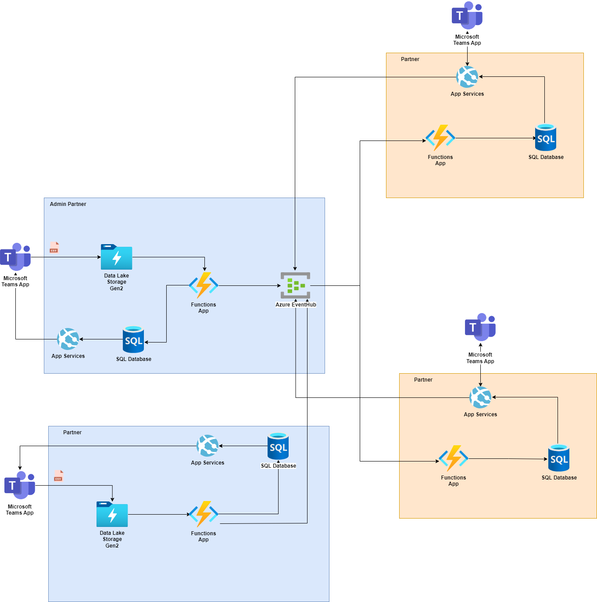

> [!WARNING]
> This repository is no longer being actively maintained and will be removed from GitHub on December 31, 2025.

# Disaster Response Data Sharing Accelerator

## Executive Summary

The Disaster Response Data Sharing Accelerator is a solution that provides near real-time data sharing based on an open data standard during a disaster or similar event.  This first package on GitHub has been developed to share data between participating partner organizations. It provides a medium for organizations in need of resources (food, water, etc.) to connect with organizations that have those resources available. This solution will also work beyond the initial use case such as for assessments.

The first proof-of-concept deployment for this solution was with a public-private-nonprofit partnership titled ‘Cascadia Disaster Response Exercise’, which simulated a response to a category 9 earthquake in the Pacific Northwest of the United States.  The package contains code and documentation needed for a tabletop exercise and can be leveraged for real-world disaster response deployment where timely data flow and coordination across partnering organizations are key.

## 1. Supported Scenarios

*	Data connections between partner organizations. 
*	For Microsoft enabled organizations, Teams app interface for pushing and receiving resource requests. 
*	For non-Microsoft enabled organizations, a Web UI or similar user interface is not yet available in this package.

## 2. Overview of Roles Required to Use this Accelerator

If your organization is functioning as a resource requestor, the following role is required:
* Resource Request Manager – operations managers working in command centers who are responsible for using the solution to input requests on behalf of the organization they represent.

If your organization is functioning as a resource provider, the following role is required:
* Resource Supply Manager - operations managers working in command centers who are responsible for using the solution to input resources they have available on behalf of the organization they represent.

**Note:** An organization can be both a requestor and a provider. 

Both resource provider and resource requestor organizations must also have the two roles below in place to effectively utilize this solution:
* Platform Support Resource(s) - Support technical needs related to platform usage.  Required skills:
  * Certified Office365 Administrator (or equivalent skillset) - Supports Teams installation and assigns Power BI / Teams licenses within the organization 
  * Certified Azure Administrator (or equivalent skillset) - Deploy Bicep templates, configure application security, provision and manage web resources
* Reporting & Data Resource(s).  Capture data associated with available resources or resource requests and convert to the required format for uploading to the platform.  Required skills:
  *	Advanced Excel skills - familiarity with generating reports in various data formats and converting Excel files to (CSV)
  *	User-level Power BI skills

## 3. Architecture Diagram

*	Azure Data Lake Storage Gen2: Responsible for storing the history of requests and triggering the Azure Functions to handle the data.
*	Azure Functions: Responsible to process, send and receive data from EventHubs. It also saves the data in SQL Server.
*	Azure Event Hub: Responsible to share data between partners in streaming mode.
*	Azure SQL: Responsible to store all processed data, and serve the Teams Application
*	App Services: Responsible to communicate with the Microsoft Teams App, and send responses to EventHub
*	Microsoft Teams App: Responsible to communicate with the User, showing the requests and the responses from partners

## 4.	Requirements

*	Incoming Data format – Data that is shared between organizations needs to follow a standardized template. The current resource solution matching template can be downloaded [here.](https://github.com/microsoft/Data-Sharing-Accelerator/blob/main/Templates/data_template.csv)
*	For Microsoft based organizations, the following licenses are required. Licenses
* Non-Microsoft based organization will need to deploy the equivalent solutions to:
  *	SQL
  *	Event Hub
  * Web UI

## 5. What’s in this Package

*	[CSV template for data](https://github.com/microsoft/Data-Sharing-Accelerator/blob/main/Templates/data_template.csv)
*	The technical documentation and user guide for the Disaster Response Real-Time Data Sharing Accelerator is a separate document. You can find it here: [User guide](USERGUIDE.md)
*	Sample demo script: [Demo script](DEMOSCRIPT.md)
*	Data sharing template for a group collaborative to create an open data commons: [Open Data Community Kit](https://github.com/microsoft/Nonprofits/tree/master/Open%20Data%20Community%20Kit)

  
