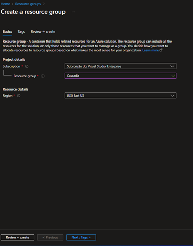
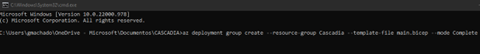
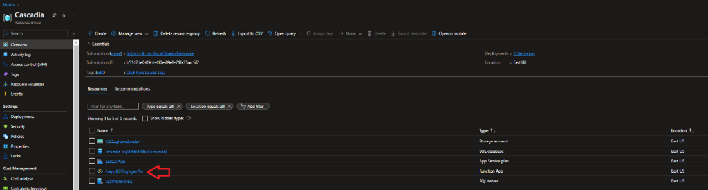
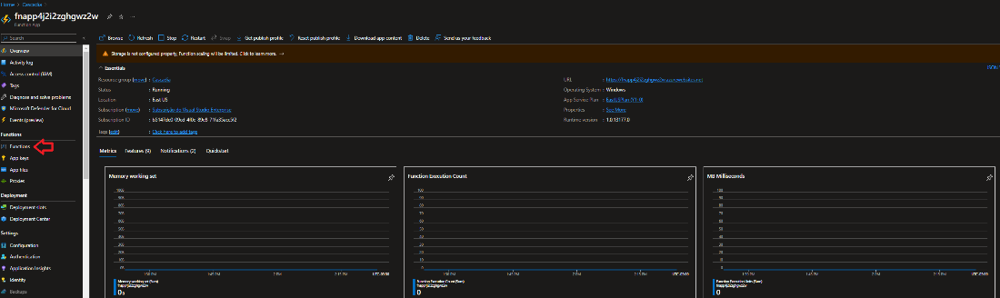
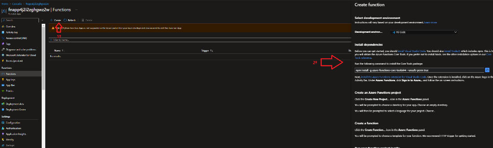
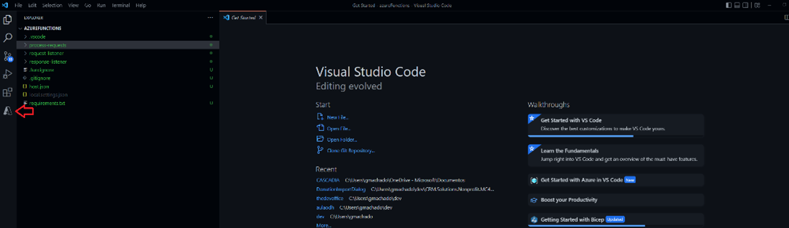
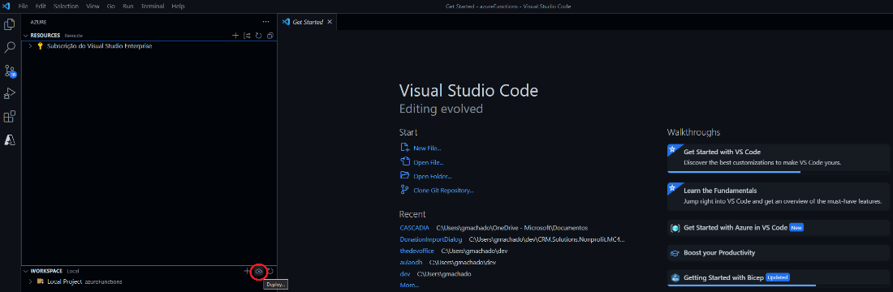
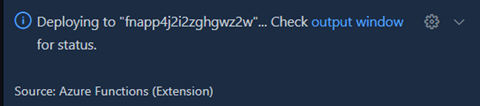

# Disaster Response Data Sharing Accelerator - User Guide

The Disaster Response Data Sharing Accelerator was built from a US-based effort titled ‘Cascadia Disaster Response Exercise’.  Consequently, the documentation below uses codebase references under the ‘Cascadia’ title.  This document provides user guidance on installing / configuring the environment (Section I.), accessing / using the environment (Section II.), and extending the data sharing solution (Section III.).  Note that there is a separate document titled ‘Disaster Response Data Sharing Accelerator - Overview’ that should be referenced prior to utilizing the content below.  An Azure subscription is required.

## I. How to Install and Configure the Environment

## 1. Provisioning Infrastructure and API

* Clone the repository containing the Cascadia source code
* Create an Azure Resource Group called “Cascadia”
  * Additional details available here: https://docs.microsoft.com/en-us/azure/azure-resource-manager/management/manage-resource-groups-portal

* Go to the root folder containing the Cascadia cloned file and execute the main .bicep file
  * Additional details available here: https://docs.microsoft.com/en-us/azure/azure-resource-manager/bicep/overview?tabs=bicep 

* This bicep script will request 4 parameters, that includes:
  * DbUsername: The username of your Database.
  * DbPassword: The password of your Database.
  * CascadiaNamespace: The partner's name on the network.
  * requestEHConnectionString: The connection string of the Request’s EventHub on the network
  * responseEHConnectionString: The connection string of the Response’s EventHub on the network

## 2. Deploying Infrastructure

* From the Overview section within the Cascadia Resource Group, click on the Function App Resource link under the ‘Resources’ list. 

* From the screen that appears, under the ‘Functions’ menu on the left, click ‘Functions’.

* Click on ‘Create’ and follow the list of instructions up until the point that says ‘Create an Azure Function’ – **do not follow any instructions from that point-on**.

* After following these steps, open your Visual Studio Code.
* Click on ‘File’, then ‘Open Folder’ and select the folder "azureFunctions” under the repository folder.
* Choose the ‘Azure’ menu icon on the left which will display available Azure Subscriptions.

* Select the ‘Workspace’ menu option and click the ‘deploy’ icon to the right then choose ‘Deploy to Function App’ from the pop-up.

* From the list of available subscriptions that appears, choose your Azure subscription, and deploy it.

## 3. Deploying an API component

* 1. Build required source code (assumes that a .net environment is installed):
  * a)	Clone the Git Repository
  * b)	Navigate to CascadiaAPI directory inside Git Repository
  * c)	Build Cascadia API (see commands below)
    * i.	dotnet restore
    * ii.	dotnet publish -c Release
* 2.	Zip the Cascadia API build artifacts:
  * a)	Compress-Archive -path .\bin\Release\netcoreapp3.1\publish\* -destinationpath .\cascadia-api.zip -Force
  * Take note of the path to the zip file as this will be referenced in **Step 3** immediately below
* 3.	Deploy Cascadia API to Azure:
  * a)	Follow the instructions via this hyperlink to deploy the Cascadia API: [Deploy files to App Service - Azure App Service | Microsoft Docs](https://learn.microsoft.com/en-us/azure/app-service/deploy-zip?tabs=powershell#deploy-a-zip-package)

## 4. Provisioning and Deploying a UI Component

* Prerequisites
  * NodeJS
  * An M365 account
  * [Teams Toolkit Visual Studio Code Extension](https://marketplace.visualstudio.com/items?itemName=TeamsDevApp.ms-teams-vscode-extension) version after 1.55 or [TeamsFx CLI](https://learn.microsoft.com/en-us/microsoftteams/platform/toolkit/teamsfx-cli)

* User Configurations
  1.	Reference Cascadia App source code file via GitHub (.env.teamsfx.dev)
    * REACT_APP_VIEW_NAME=
    * REACT_APP_PARTNER_NAME=
    * REACT_APP_STORAGE_CONNECTION_STRING=
    * REACT_APP_API_ENDPOINT= 
    * a.	Set View Name = to Requestor or Provider, depending on your status
    * b.	Set Partner Name = to match how your organization is listed in the database
    * c.	Set Connection String = to SaaS Token for Data Lake Storage (only applies to requestors)
    * d.	Set API Endpoint = to match the Endpoint URL that results from GitHub actions
  2.	Reference Cascadia App source code file via GitHub (config.dev.json)
    * a)	Reference line "reportendpoint" : "<PowerBI URI>"
    * b)	Set <PowerBI URI> = (Get this URI from your PowerBI administrator and reference the section at the end of this document on implementing the PowerBI service).

 * Edit the Manifest
   * You can find the Teams App Manifest in the templates/appPackage folder. The folder contains the following file: manifest.remote.template.json – (manifest file for Teams app running remotely after deployment to Azure).  This file contains template arguments with {...} statements which will be replaced at build time.  You may add any properties or permissions you require to this file.  See the [schema reference](https://learn.microsoft.com/en-us/microsoftteams/platform/resources/schema/manifest-schema) for more information.

* Deploy to Azure
  * Deploy your project to Azure by following these steps, based on whether you’re using **Visual Studio Code** or **TeamsFX CLI**.
  1. Visual Studio Code Users
     1. Open Teams Toolkit, and sign into Azure by clicking ‘Sign in to Azure’ under the **ACCOUNTS** section from the sidebar menu.  After you sign in, select a subscription under your account.
     2. Open the Teams Toolkit and click **Provision in the cloud** from the **DEPLOYMENT** section, or open the command palette and select ‘Teams: Provision in the cloud’.
     3. Open the Teams Toolkit and click ‘**Deploy to the cloud**’, or open the command palette and select: **Teams: Deploy to the cloud**.
  2. TeamsFX CLI Users
     1. Run command: **teamsfx account login azure**
     2. Run command: **teamsfx account set --subscription <your-subscription-id>**
     3. Run command: **teamsfx provision**
     4. Run command: **teamsfx deploy**

* Validate Manifest File
  * Visual Studio Code or TeamsFX CLI users follow the steps below to verify the Manifest File is valid:
    * Visual Studio Code: open the Teams Toolkit and click **Validate manifest file**, or open the command palette and select **Teams: Validate manifest file**
    * **TeamsFx CLI**: run command: **teamsfx validate** in your project directory.

* Package
  * From Visual Studio Code, open the command palette and select **Teams: Zip Teams metadata package**
		-or-
  *	In **TeamsFX CLI**, from the command line run **teamsfx package** in the project directory

* Publish to Teams via Teams Administration Portal
 1.	Based on activities described above, user will receive Zip files as an output in GitHub
 2.	Navigate to Teams Admin Page - https://admin.teams.microsoft.com/
 3.	Navigate to ‘Teams Apps’, ‘Manage Apps’ via menu bar on the left
 4.	Select ‘Upload’
 5.	From the pop-up displayed that says, ‘Upload a Custom App’, choose ‘Upload’
 6.	From the file explorer screen, navigate to the folder containing related Zip file(s)
 7.	Select correct Zip File and choose ‘Open’
 8.	You will see a confirmation message that says ‘New App Added’
 9.	From that pop-up, click the link that is available to ‘manage’ the app

## 5. Configure Web Authentication
  1.	Navigate to the Cascadia Web API in the Azure Portal
  2.	From the menu on the left, under ‘Settings’, select ‘Configuration’
  3.	In the ‘Application Settings’ window that appears, select ‘New Application Setting’
  4.	In the Pop-up window under ‘Name’, enter ‘AzureAd:ClientId’ (without quotes)
  5.	Look up the REACT_APP_Client_ID value located in the Cascadia UI Tabs .env file.  Once located, enter this information in the Value field
  6.	Click ‘Ok’, which returns you to the ‘Configuration’ window
  7.	In the ‘Application Settings’ window that appears, select ‘New Application Setting’
  8.	In the Pop-up window under ‘Name’, enter ‘AzureAdTenantId’ (without quotes)
  9.	In the ‘Value’ field, enter the GUID associated with your Azure Tenant ID.  For additional detail on this process, reference the following link:  https://docs.microsoft.com/en-us/azure/active-directory/fundamentals/active-directory-how-to-find-tenant 
  10.	Click ‘Ok’, which returns you to the ‘Configuration’ window
  11.	Click ‘Save’ from the top menu bar

## II.	How to Access & Use the Environment
(Specific Guidance Related to the UI and Power BI Components)
The instructions provided in this section demonstrate how to perform key actions for the two primary users of the platform – **Resource Requestors** and **Resource Providers**. Depending on which category your organization aligns to, refer to the corresponding section.  All users need to complete the steps provided immediately below under ‘Pinning the Cascadia App’.

* Pinning the Cascadia App
 1.	Navigate to: https://teams.microsoft.com/
 2.	Begin by pinning the Cascadia app to the Teams rail
    * Select the ellipsis from the menu on the left and choose ‘Cascadia’ from the pop-up menu
    * Select the Cascadia app, which will affix the icon to your Teams rail
 3.	Choose the Cascadia app icon from the Teams rail

* Using the Platform
  * Resource Requestors - key user actions
    * How to make a request
      1.	Complete the information required in the pre-configured request form (likely an Excel file) and save as a .csv file (the platform only accepts .csv files for upload)
      2.	From the Welcome screen, choose the icon in the upper left that says ‘Upload File’
      3.	Select the request form file that was saved
    * How to check the status of the request
      1.	From the Welcome screen, refer to the Status column and information adjacent to your request
  * Resource Providers - key user actions
    * How to review existing requests for resources
      1.	From the Welcome screen, all open and accepted requests will be visible
    * How to accept requests for resources
      1.	From the Welcome screen, select an outstanding request in alignment with your available resources
      2.	Use the selection checkmark options on the left and choose outstanding requests you want to accept. Checkmark those options
      3.	Click the ‘Accept’ menu option that appears above the ‘Location’ column heading
      4.	From the pop-up that says ‘Would you like to accept the requested items’, choose ‘save’ to accept or ‘cancel’

* Enabling and Using Power BI Functionality
  * Power BI capabilities can be enabled but are *not* required to utilize the platform effectively.  The Power BI dashboard provides an aggregated view of both Resource Requestor and Resource Provider activity within the Cascadia platform – for example:
    * Total outstanding requests
    * Total fulfilled requests
    * Geographical mapping information
  * **Section 1.** details the simplest way to access Power BI regardless of current corporate or personal subscription status – via desktop installation.  
  * **Section 2.** provides guidance to those who either currently utilize or wish to utilize Power BI-Pro, which enables access from any internet-enabled device. 
  * **Section 3.** covers how to embed Power BI into the Teams application for ease of accessibility, and is a feature only available to Power BI Premium users.
